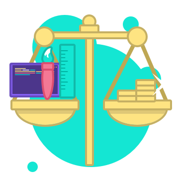

FILTRO JAVASCRIPT

Explciacion de cada una de las partes del codgio generado para este filtro
#CSS

*{
    margin: 0;
}
 //Margenes basicas las cuales quedan como defecto
body{
    background: #3D3935;
    color: #FFFFFF;
    padding: 2rem 1rem;
}
//El estilo de colores para el cuerpo del HTML
button{
    background-color:rgb(46, 154, 226);
    color:rgb(46, 154, 226);
}
//COlores para el funcionamiento del boton
h1{
    text-align: center;
    color:rgb(46, 154, 226);
}
//Color y margenes para el texto
.text{
    text-align: center;
    color: white;
}
//Funcionamiento de los textos y su color
.Categorias{
    display: grid;
    grid: 2;
}
//Separacion para las categorias y el funcionamiento ajustable
.divison{
    grid-row: 4rem;
}
//separacion entre cad auna de las categorias
img{
    width: 80%;
    max-width: 200px;
    height: auto;
}
// Margenes y estilos de las imagenes

#JS

Para cada una de las categorias las cuales estaba centradas en el diseño y formato de las mecanicas solicitadas se entrego un formato de Swich el cual ayudara a seleccionar segun las aspiraciones de las personas
function Calidad(Obtain){
    switch(Obtain){
        case 1:
            Costos += 300.000
        break
        case 2:
            Costos += 380.000
        break
        case 3:
            Costos += 200.000
        break
    }
} //Primera categoria cetentrada en la calidad
function Type(Obtain){
    switch(Obtain){
        case 1:
            Costos += 2000.000
        break
        case 2:
            Costos += 3000.000
        break
        case 3:
            Costos += 800.000
        break
        case 4:
            Costos += 3500.000
        break
    }
} //Segunda Centrada en el estilo de los dispositivos a los cuales iria dirigida
function Dysaine(Obtain){
    switch(Obtain){
        case 1:
            Costos += 500.000
        break
        case 2:
            Costos += 1000.000
        break
        case 3:
            Costos += 800.000
        break
        case 4:
            Costos += 300.000
        break
    }
}
// Tercera centrada en el estilo de la Api
function Money(Obtain){
    switch(Obtain){
        case 1:
            Costos += 600.000
        break
        case 2:
            Costos += 1000.000
        break
        case 3:
            Costos += 2000.000
        break
        case 4:
            Costos += 3500.000
        break
    }
}
//Cuarta centrada en el estilo de Monetizacion de La api
function Autentication(Obtain){
    switch(Obtain){
        case 1:
            Costos += 2000.000
        break
        case 2:
            Costos += 1500.000
        break
        case 3:
            Costos += 0
        break
        case 4:
            Costos += 3500.000
        break
    }
}
 // Quinta la cual esta centrada en un metodo de verificacion de la APi
function sendInfo(){
    console.log(Costos);
}
//Este entrega el Valor total de los costos los cuales se trabajaron en el JS

#HTML

<section id="0" class="container">
        

            

                
                <h1> ¿Cuánto cuesta desarrollar mi app GBP?</h1>
                
Calcula de forma rapida el costo de crear tu app, contestando estas sencillas preguntas

                <button onclick="nextComponent(0, 1)" class="button">
                    INICIAR
                </button>
            

        

    </section>
//La primera marte estaba centrada en darle un menu y un formato basico para inciar su recorrido guardando la informacion correspondiente a medida de que se movia

Por cada una de las secciones divisadas se demostro un estilo estetico separado en secciones dependiendo del ID y la faccion que correspondia.

EJEMPLO: 
<section id="01" class ="Categorias, division">
        <h1 class ="text"> ¿Qué nivel de calidad estás buscando?</h1>
        

            
            
Calidad Optima

        

        

            
            
Buena relación Calidad/precio
        
        

        

            
            
No me importa tanto la calidad
       
        

    </section>

Finalmennte estas se separaban en 5 las cuales era quienes les daba forma a todas las peticiones que se hacian en los SWICH

Como se podra percatar no tiene guardado en JSON-server pormdificultades de TOma y archivado de datos.